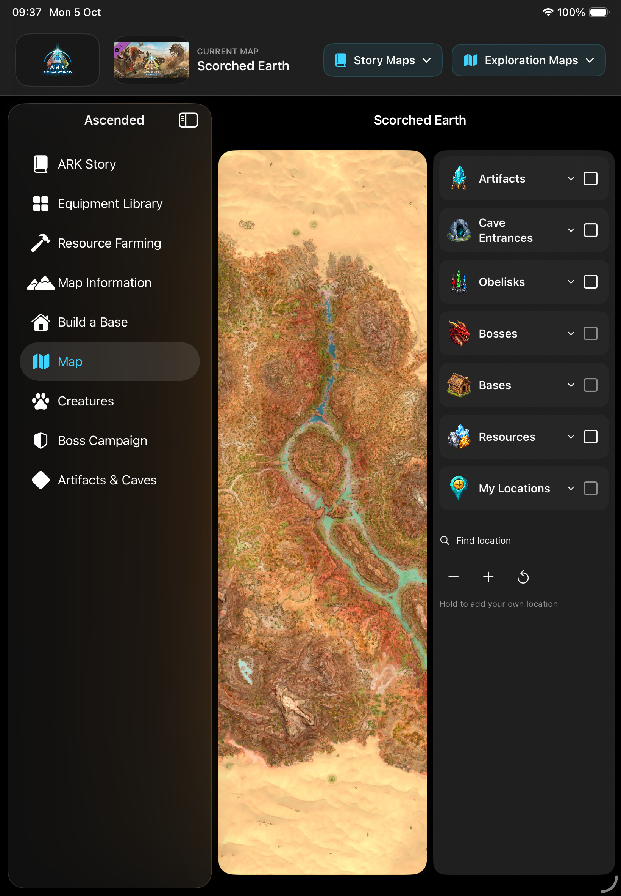
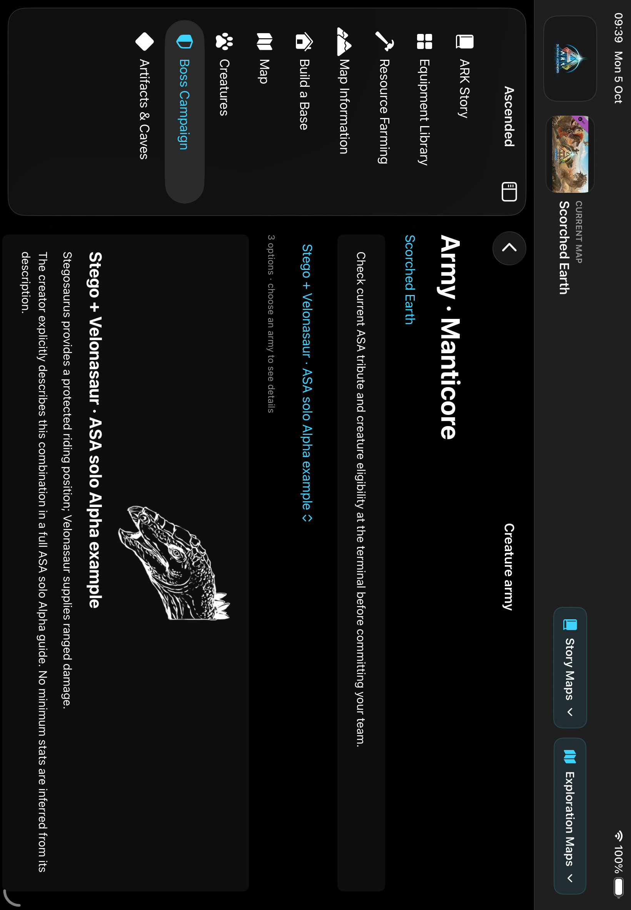

# Ascended 0.20.0 (21) — content continuation

Standalone native iPad development delivery. Started from clean `1727e69` on `codex/ascended-ipad-dev-20261003`; fetched origin first. No Tony OS, TestFlight, web hosting or public domain.

## Changes

- Added 73 ASA source references: 36 cave entrances, obelisks/terminals and a retained Chaos artifact reference. 68 records fit the current terrain plane; five outside-plane records remain unclamped in the evidence catalogue. Twelve exact entrance photos. Existing route and colored obelisk IDs remain stable. Wiki entrances supersede older actor-based route positions. Explicit Rockwell/Overseer summon points are distinct from remote arenas.
- Fixed duplicate Ragnarok obelisks discovered in independent review. Explicit source names determine color and canonical identity; there are three pins, not six overlapping copies.
- Added seven expansion campaign outlines, Manticore/Rockwell difficulty and tribute profiles, practical Scorched army options, nine paid-creature corrections, and 83 missing creature profile rows. Missing boss profiles do not lead to blank pages. All new visible text is English.
- Added twelve exact transparent species icons plus Manticore/Rockwell icons, rendered white. Island now uses its actual terrain thumbnail instead of repeating the general ARK logo.
- Resource library now has 52 filmed regions and 156 distinct offline loops. Fifteen guides demonstrate harvesting/loot; the other 37 remain identified as region, resource, interaction or production views. The acquisition audit tracks 454 category entries across eleven selectable map planes, with candidate chapter links kept separate from verified footage.
- Real portrait geometry now works after restarting only the Ascended Simulator. The map rail uses 240 points so labels remain readable. Construction bills consistently say Materials to gather. Gamma no-apex text is suppressed when a boss actually requires tribute.

## Verification and delivery

The first compile exposed a SwiftUI type-checking limit in the expanded resource cards. Extracting two view helpers fixed it; full Simulator build succeeded. The new unit tests cover reference identity/source metadata, out-of-plane exclusion, stable Tek Cave route navigation, expansion campaign decoding, boss images and three-difficulty table lengths. Final scoped test results and physical delivery receipt are appended below after completion.

Signed native bundle is verified against current resource bytes; final fresh delivery is `/Volumes/TONY SSD/ASCENDED_MEDIA/builds/Ascended-0.20.0-21-final-delivery/Ascended.app`. USB was confirmed after the user's reconnect message. No uninstall or user-data reset.

Final scoped run: **16 unit + 8 UI cases passed, zero failures/skips**, result `Test-Ascended-2026.10.05_09-35-40-+0700.xcresult`. Actual portrait framebuffer and readable rail passed; screenshots exported to `ascended-0.20.0-21/` and visually inspected. An earlier broad run was stopped after the current seven UI cases passed, avoiding obsolete test flows from retired interfaces; the final selected suite includes those seven plus the new expansion army test. All eleven original creature roster ID sets are unchanged. All current JSON/MP4/JPEG source bytes match the signed final app bundle; deep/strict codesign verification passed.

## Still unfinished

This is substantial additional content, not completion of the entire encyclopedia. The evidence ledgers retain 310 unverified creature profiles and 266 resource-category verification gaps. Expansion campaigns without sourced army/tribute details remain outlines. Full expansion cave walkthroughs, missing entrance photos, eleven creator-video links, exact DevKit geometry and independent runtime GPS calibration remain open.

Normal licensed YouTube acquisition returned HTTP403, captions/Wiki marker requests returned429, and Cốc Cốc's download panel offered no formats. Source requests stopped on rate limits/refusals; no restrictions were bypassed and no replacement footage or guessed coordinates were inserted. Most expansion entrance/terminal coverage is still incomplete. Atlas pixel/GPS round trips establish source-plane consistency, not zero-error in-game GPS on every map.

Evidence: [ASA references](2026-10-05-asa-reference-locations.md), [portrait QA](2026-10-05-ascended-portrait-qa.md), [campaign sources](2026-10-05-expansion-campaign-sources.json), [creature profiles](2026-10-05-expansion-creature-profiles.json), [resource acquisition](../../tools/evidence/RESOURCE_ACQUISITION.md), [species icons](2026-10-05-species-icon-sources.json).

## Physical delivery receipt

Final fresh-bundle installation succeeded over the reconnected USB interface. Fresh device inventory confirms **Ascended0.20.0/build21**, development-signed, at the same installation URL returned by the final install transaction (database sequence1608). Native launch succeeded, process1392. The final bundle includes both new boss icons and all83profile changes; every bundled JSON/video/JPEG matches current source bytes. No TestFlight upload. Physical installation and process launch are proven; touch interaction and playback performance on the device are not claimed from Simulator screenshots.

Receipt logs: `/tmp/ascended21-final-install.json`, `/tmp/ascended21-final-readback.json`, `/tmp/ascended21-final-launch.json`. An earlier same-version candidate was installed before the last two icon additions; the final fresh transaction supersedes it and is the receipt reported here.
