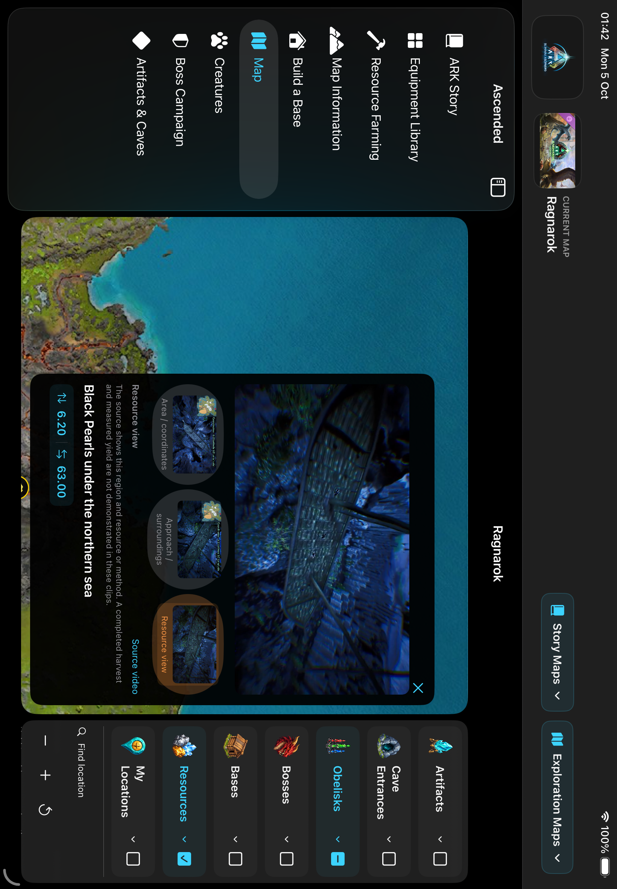
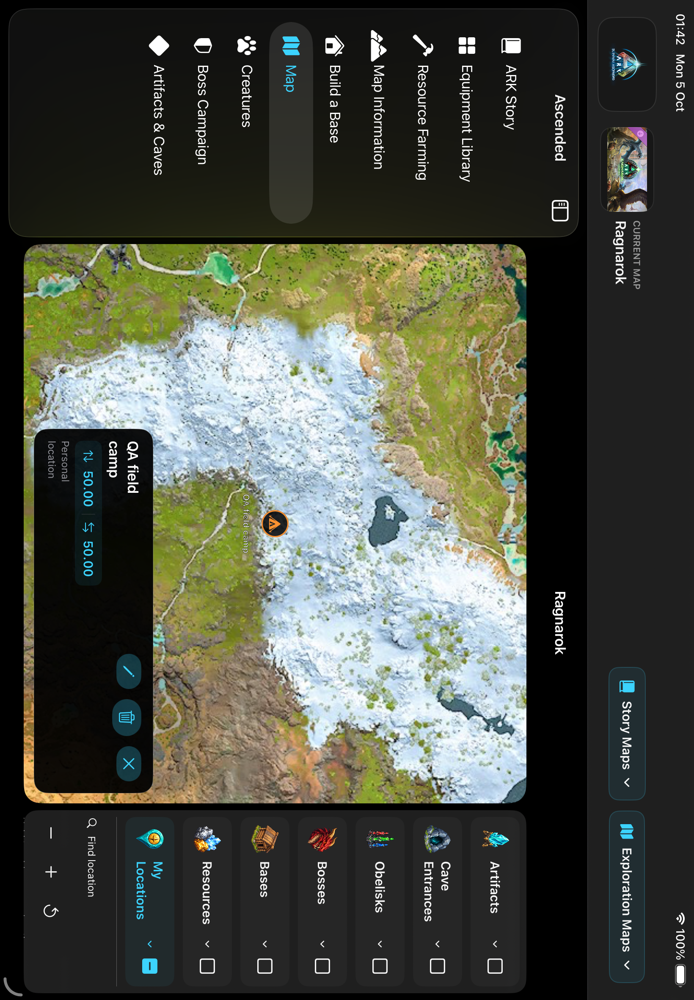
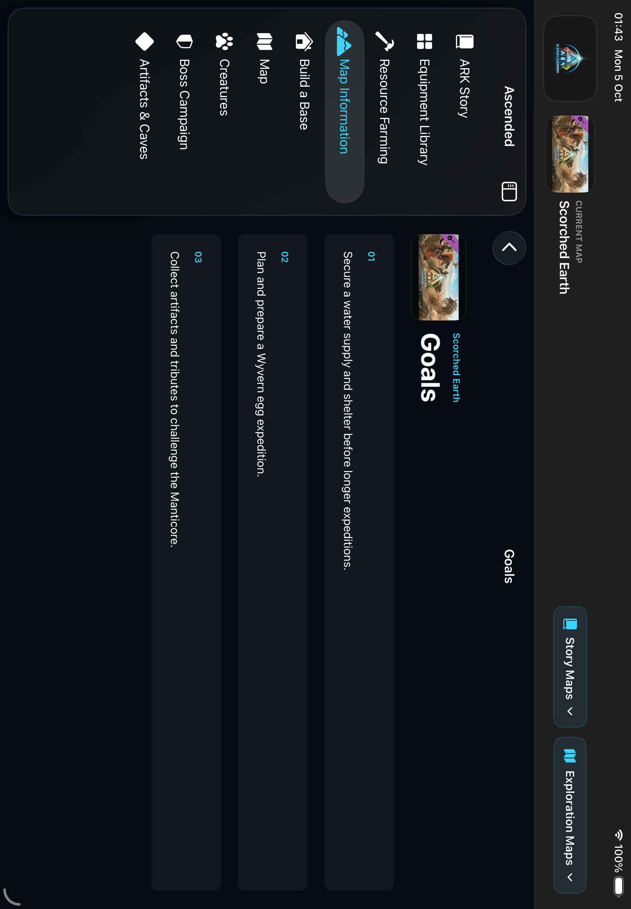
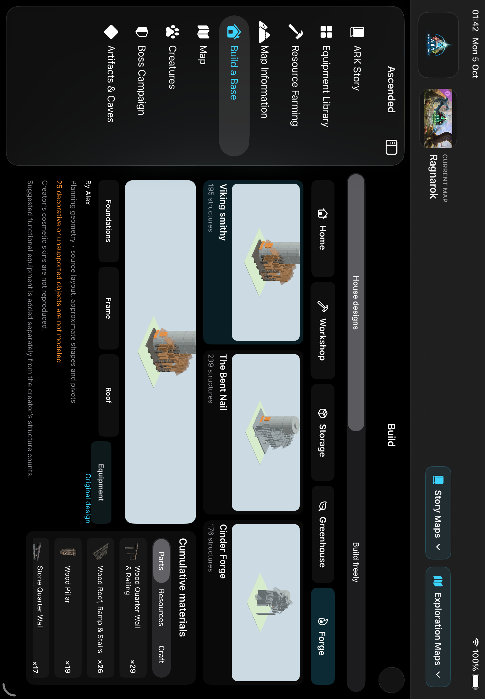

# Ascended 0.19.0 (20) — map field companion

Standalone native iPad development update. Starting checkout clean on codex/ascended-ipad-dev-20261003 at 2c5d427; origin fetched before edits. Cable distribution only. No TestFlight, Tony OS, web hosting or domain deployment.

## Behavior

Story/Exploration picker rows no longer show northeast arrows. The current map and ARK artwork are larger, rounded and separated. Genesis Ocean is nested under Genesis Part 1 as a biome/coordinate plane, not a separate expansion. Map Information now uses topic overview cards that navigate to dedicated detail pages. Complete instructions remain readable: long prose is no longer replaced by the first matching resource icon, and alternatives/boss-to-artifact relationships retain their meaning.

Seven new transparent illustrations identify map layers. Map sessions start with no selected layers. Category labels expand lists; separate checkboxes select every member. Individual artifacts, entrances, obelisks, bosses, bases and personal points use ID selection; resource types use membership intersection. Parent partial/all/none state follows its children. Global all/clear controls removed. Unverified raw resource-node datasets are no longer displayed as video-verified pins.

Long press terrain to add a named personal point with icon, color and decimal coordinate wheels. Image-local coordinates survive zoom and pan. Saved locations persist per map; edit and delete are available on their popup. Marker content, coordinates and tint refresh after edits. Existing notes/builds/progress storage retained.

Resource popups have three distinct muted native autoplay clips with thumbnail selectors and timestamped canonical YouTube links. 51 filmed regions across all 11 selectable map planes; 153 1280×720 H.264 clips, 153 posters, derived from 23 native1080p sources. Only 12 guides demonstrate harvesting/loot; 39 explicitly show resource/region/method views. User's prior license approval retained. New complete-source downloads returned HTTP403 after initial source footage arrived: only successfully received and decoded sequences used, with limits in sourceAcquisition metadata.

Build audit: verified recipe station data is consistent between equipment and construction detail. Unknown stations no longer silently default to Inventory. Expanded bills say Materials to gather rather than claiming every remaining intermediate is a raw material. Existing 15 layouts, five zones, phase quantities and manual designs preserved. Missing SF Symbol pickaxe replaced with supported hammer artwork.

## Verification

- Final signed physical build: BUILD SUCCEEDED; signature deep/strict verification passed; bundle plist 0.19.0 /20.
- Final Simulator unit/UI run: 14 unit cases +4 UI cases passed; additional2 functional UI cases passed (top rail/header, seven-column library and story). Portrait proof remains unavailable: the old screenshot was actually landscape; a strict geometry check timed out after sensor rotation. SpringBoard also stayed landscape in manual rotation checks. QA now separates portrait geometry and explicitly skips it when the Simulator does not deliver interface rotation. Final02:05 run passed the story/library case with0 failures and1 explicit portrait skip; result Test-Ascended-2026.10.05_02-05-18-+0700.xcresult. No portrait rendering success is claimed.
- Unit coverage: GPS round trips/boundaries/invalid touches, UIKit image conversion under transformed/panned scroll view, parent/partial selection, resource intersection, save serialization/map isolation, semantic prose/alternative preservation, bundle media/posters/all-map coverage, recipe expansion and build phase/count integrity.
- UI coverage: empty initial layers, parent/individual artifact and obelisk choice, three source-clip selectors, long-press point save/relaunch/map isolation, Scorched detailed goals, builder stage changes/manual isolation, landscape header and library layout. Screenshots inspected and stored below.
- Final test result bundles: Test-Ascended-2026.10.05_01-41-28-+0700.xcresult; Test-Ascended-2026.10.05_01-46-10-+0700.xcresult, under the SSD Simulator DerivedData Logs/Test directory.
- 153 source-manifest MP4 hashes and poster files independently checked; all153 fully decoded in media worker validation. Three distinct hashes per guide. All artifact imageAsset references across11 maps resolve to existing imagesets.
- Initial test failed because a SwiftUI menu does not retain child IDs in the native menu hierarchy; updated QA to use actual rendered resource markers. Final run passed. No product workaround masking this failure.
- Independent review found alternative separator meaning loss and duration-only clip cache staleness. Fixed both: prose retained for alternatives; generation always regenerates source intervals. git diff --check passed.

## Data limits still outstanding

See [all-map inventory](2026-10-05-atlas-data-audit.json) for actual counts. This is not exhaustive every-resource or every-node coverage. Most expansion cave entrance/terminal/boss map coordinates are absent until source verification; their filter groups report no verified locations instead of inventing pins. The Island API22 has no obelisk records. Extinction's Chaos artifact source latitude101.206 falls outside the bundled0–100 plane and was not silently clamped. Existing base scouting/map badge data were not re-derived from game runtime this turn.

Projection was compared with Wikily's published client function j(lon,lat), which maps the full0–100 plane to normalized tiles. Native long press uses the same image-local pixel plane. This proves atlas consistency, not absolute in-game GPS calibration on all maps. Island mini-map/waypoint differences remain uncalibrated. GPS region evidence identifies a filmed area/waypoint, not every resource actor or exact respawn.

Existing community build limitations remain: approximate authored geometry, not original DevKit meshes; 11 templates lack linked creator videos; suggested equipment is not part of an asserted creator recipe count.

## Delivery

Signed fresh delivery bundle: /Volumes/TONY SSD/ASCENDED_MEDIA/builds/Ascended-0.19.0-20-delivery/Ascended.app. First device-install attempt failed at 01:50 with CoreDevice3002 /IXRemoteErrorDomain6, Connection interrupted. Concurrent read-only device inventory timed out. Device remains listed as paired/available, which does not prove usable app services or installation. Requested cable/unlock check. Subsequent device inventory succeeded and confirms prior0.18.0/build19 remains installed. CoreDevice reports localNetwork transport; no iPad was enumerated on USB. Second installation also failed with the same Connection interrupted /IXRemoteErrorDomain6 after about5min40s. Fresh final device inventory at2026-10-05 02:04:18 +07 confirms0.18.0/build19 still installed. Version20 is NOT installed/launched. USB cable/unlock check remains requested; no third retry without an external connection change. No uninstall performed.

## Visual evidence

