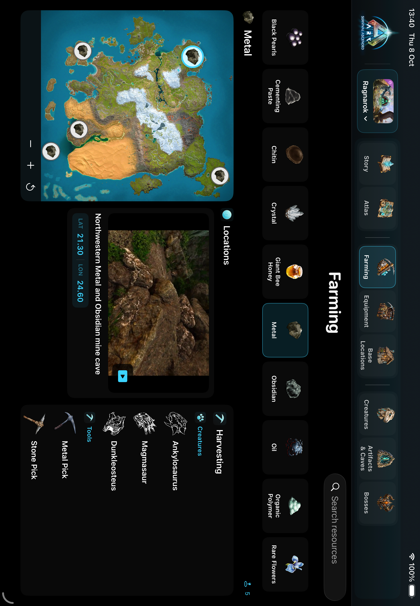

# Ascended 0.33.0 (34): Farming expansion

Added 52 distinct filmed regions: 23 on The Center, 14 on Ragnarok, 13 on Aberration and 2 on Lost Colony. The catalogue contains 156 verified regions; 146 match the user's 14-resource Farming filter. Existing non-curated records remain outside that filter.

Each new region has a continuous 6–8 second silent loop without an in-game map or inventory covering the scene, source timestamps, numeric coordinate authority, media hashes and visual evidence. A Scorched Earth Metal loop was extended to 7 seconds. Sources are licensed under the user's prior approval.

Shared regions select exactly one loop for the selected resource. Ragnarok 21.3/24.6 keeps one pin with separate Metal, Black Pearls and original Obsidian views. Center 15/50.3 similarly has separate Metal and Obsidian clips and counts as one region. Resource changes reset the active player identity.

## Evidence and limits

- Ragnarok: complete approved Fynix `0i0-XEV85m8` cache; creator numerical regional captions retained.
- Center: complete approved Raasclark `d3d4cAzEpr0` cache; 24 clips merged into 23 regions. Caption 52.5/69.2 was corrected before integration.
- Aberration: normal public playback of `TUoB8ouWPYk`, recorded through an isolated silent Chrome window. Coordinates are explicit creator LAT/LONG regional labels, not native player GPS. Crystal acquisition from coloured gems is separately documented.
- Lost Colony: independent `LKOZNBaoCpc` source, 65.6/48.3 cave and 59.5/58.6 river. River spoken regional coordinates are distinguished from the nearby 59.5/58.5 map readout. With the existing Oil region, Lost Colony has three filmed Oil regions.
- RtR Lost Colony 69/46.4 and broad Extinction methods were withheld because precise vanilla-source coordinate authority was insufficient. Silicate, Corrupted Nodules and Scrap Metal were not relabelled as the requested raw resources.
- The failed full Valguero recording lacks an MP4 moov atom and is rejected. Recorder V3 adds safe error codes and durable failure clocks; fragment recovery remains unverified. Moving the owned source window to the Mac monitor restored a full capture surface. A new bounded Valguero reference is pending review and is excluded from this build.

Full coverage remains incomplete: 22 of 154 raw map/resource combinations meet three distinct filmed regions; 334 raw additional regions remain before applicability is resolved. Zero is not evidence of absence. Older short clips remain; this report does not claim every legacy loop lasts 6–10 seconds.

## Verification and delivery

`tools/validate_farming34.py` passed for 156 guides, 146 curated-visible regions and 5 resource-specific selectors. Checks cover resource aliases, icons, coordinates, media format, silence, hashes, posters and variant decodes. The integration helper fully decoded every newly accepted clip. Each new Center loop was reviewed at 4 fps, with additional root inspection of representative full-shot sheets and the shared region.

Fresh final run: 8 MapField unit tests and 5 Farming UI flows, 13 passed, 0 failed. It covers fixed columns, compact labels, one selected clip, shared-region resource changes and map-scoped Genesis Ocean/Land selections. The first final attempt found an optional-Bool assertion compile error in the new test; the assertion was corrected and the complete scoped run passed. Earlier RED/GREEN evidence is retained externally.

Dedicated `Ascended iPad QA` Simulator: installed and freshly launched 0.33.0/build 34, PID 27702. Both installed catalogue manifests match source SHA256. Receipt: `tools/evidence/farming34/simulator-install.json`. Test evidence: `/Volumes/TONY SSD/ASCENDED_MEDIA/farming34/final2.xcresult`.

Internal storage exhaustion was resolved by moving only this checkout to SSD. All 6,529 files were SHA256/size-verified, including matching paths and symlink targets, before replacing the original path with a link to the verified copy. Logical checkout path and branch remain unchanged; other projects were not altered.

Standalone native Ascended delivery is Simulator-only. There is no official website domain for this app. No Tony OS, physical iPad or TestFlight deployment is included.
